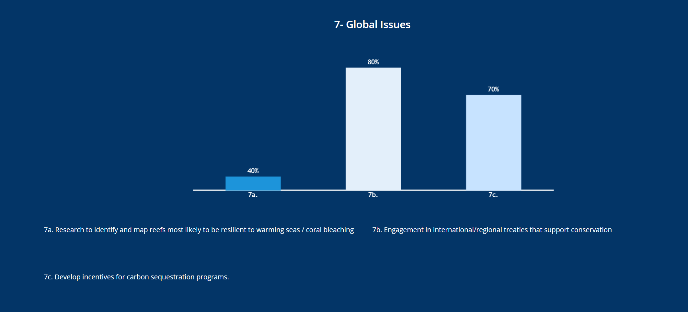

# Assignment_8

# Changing the "Bad Plot"

In this project I show how to improve a misleading and not well designed chart by using R and ggplot2.

## Example of a Bad Plot

The chart above exaggerates the differences in bar height, which makes it very misleading for viewers.  
I contributed code to recreate this chart in a more accurate, readable and appropriate format.

